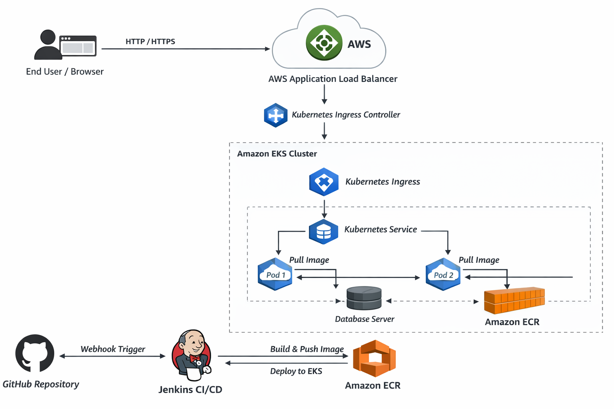
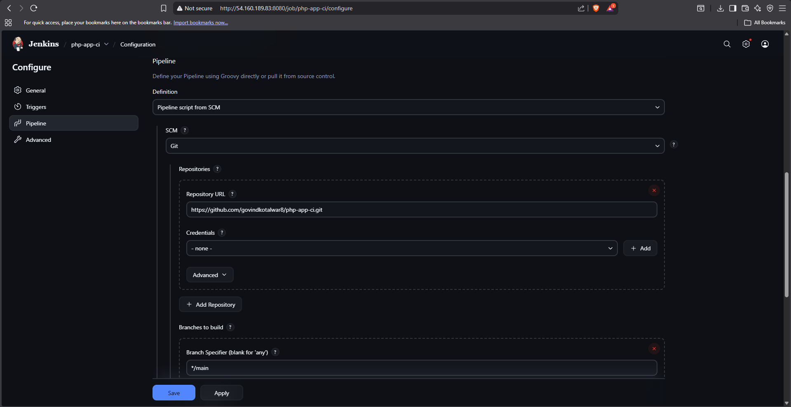
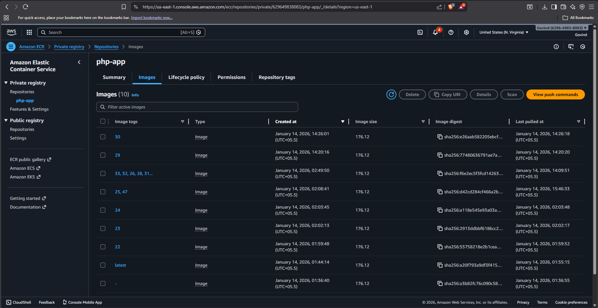
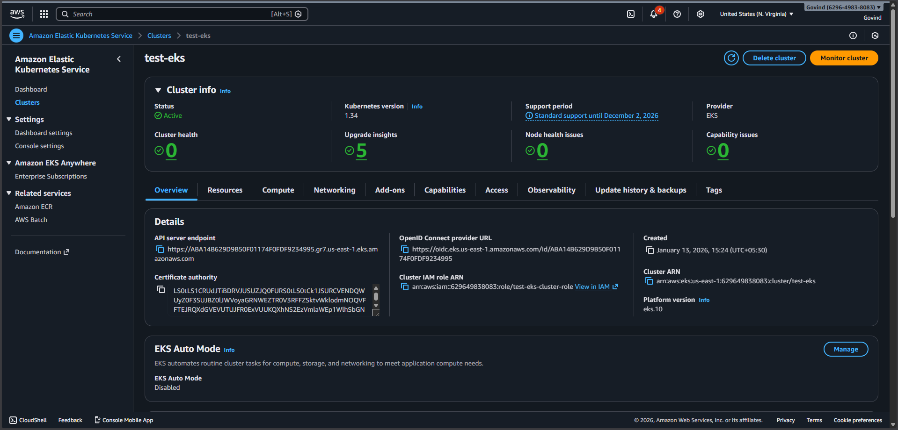
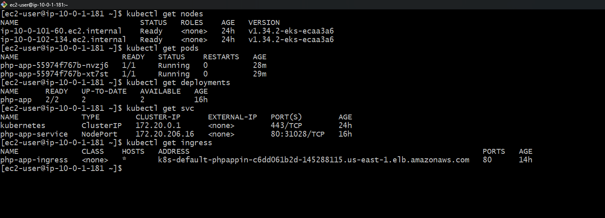
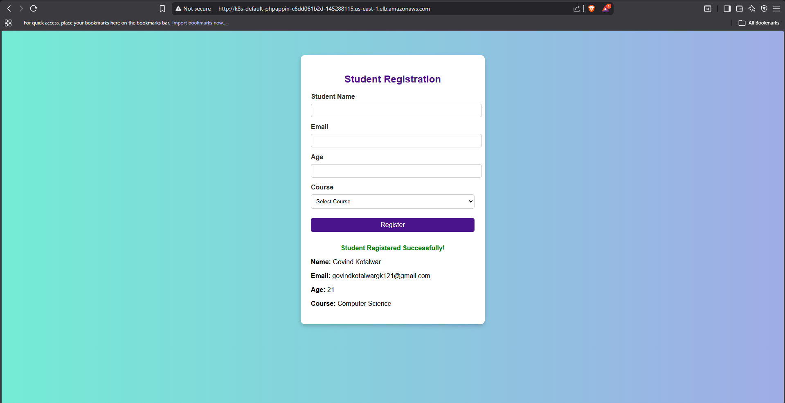

# Kubernetes CI/CD Deployment on AWS (EKS)

This repository demonstrates a complete CI/CD and infrastructure setup for deploying a containerized PHP application on **Amazon EKS** using **Terraform, Ansible, Jenkins, Docker, and AWS services**.

The project represents a real-world DevOps workflow where infrastructure provisioning, application build, and deployment are fully automated.

---

## Architecture

Below are screenshots from the live, running system.

### Architecture Diagram

## Architecture Overview

The system consists of three main layers:

1. Infrastructure Provisioning
2. CI/CD Pipeline
3. Application Runtime on Kubernetes (EKS)

The architecture uses AWS managed services combined with Kubernetes-native components to ensure scalability, reliability, and automation.

---

## Infrastructure Provisioning

### Terraform
Terraform is used to provision and manage AWS infrastructure, including:
- Amazon EKS cluster
- Application Load Balancer (ALB)
- VPC, subnets, and security groups
- IAM roles and policies

All infrastructure is defined as code and managed through version control.

### Ansible
Ansible is used for configuration management and automation tasks such as:
- Installing required tools
- Configuring Jenkins and system dependencies
- Supporting post-provisioning setup

---

## CI/CD Pipeline

### GitHub
- Hosts the application source code
- Any code push triggers the CI/CD pipeline via webhook

### Jenkins
Jenkins handles the complete CI/CD workflow:
1. Receives webhook trigger from GitHub
2. Builds the Docker image
3. Pushes the image to Amazon ECR
4. Deploys the application to Amazon EKS

This enables continuous integration and continuous deployment with zero manual steps.

---

## Container Registry (Amazon ECR)

- Docker images are stored in Amazon Elastic Container Registry
- Jenkins pushes versioned images to ECR
- Kubernetes pods pull images directly from ECR during deployment

---

## Application Runtime on Amazon EKS

### Load Balancing and Ingress
- AWS Application Load Balancer exposes the application publicly
- Kubernetes Ingress Controller manages ALB resources
- Kubernetes Ingress routes traffic to the application service

### Kubernetes Services and Pods
- Kubernetes Service provides stable networking
- Multiple application pods ensure high availability
- Pods run the PHP Student Application
- Application connects to the database backend

---

## Screenshots

### Jenkins CI/CD Pipeline
Jenkins pipeline showing successful build, Docker image push, and deployment to EKS.

---

### Amazon ECR Repository
Docker images successfully pushed to Amazon ECR.

---

### Amazon EKS Cluster
EKS cluster with worker nodes in a healthy state.

---

### Kubernetes Pods and Services
Running application pods and services inside the EKS cluster.

---

### Application Running in Browser
PHP Student Application accessible via the public ALB endpoint.

---

## End-to-End Flow

1. Code is pushed to GitHub
2. GitHub triggers Jenkins via webhook
3. Jenkins builds and pushes Docker image to ECR
4. Jenkins deploys the application to EKS
5. Kubernetes pulls the image from ECR
6. Application is available through AWS ALB

---

## Tools and Technologies

- AWS (EKS, ECR, ALB)
- Kubernetes
- Terraform
- Ansible
- Jenkins
- Docker
- GitHub

---

## Purpose of This Repository

This project is intended for:
- Learning Kubernetes and AWS EKS
- Demonstrating CI/CD best practices
- DevOps and Cloud interview preparation
- Portfolio and reference architecture use

---

## Future Enhancements

- Add monitoring and logging (Prometheus, Grafana, CloudWatch)
- Implement security and image scanning
- Use Helm for deployments
- Enable blue/green or canary deployments

---

## Author

Maintained as a DevOps learning and demonstration project.
